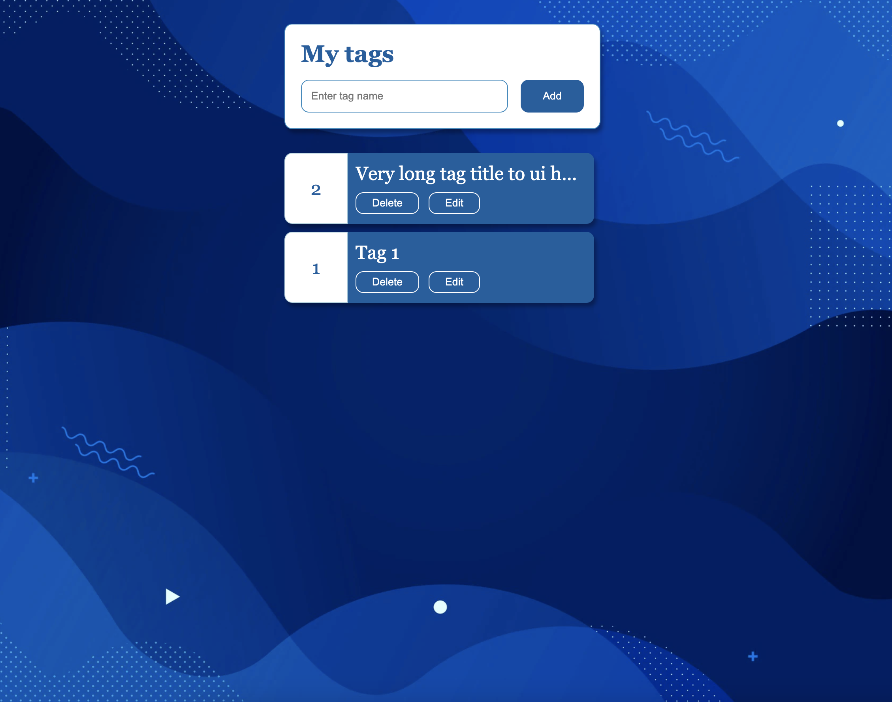

# move-react-tags

React project using MVVM Design Pattern

These are the project criteria:
- It should have the ability to add, edit and delete tags locally. 
- It should list the tags.
- The client will fetch an existing list from a back-end. (used https://mockapi.io/);
- Bonus: you can sync the local tags with a back-end using an API.

Used the following stack:
- ReactJS
- TypeScript
- Emotion / Styled Components
- Jest + Testing Library
